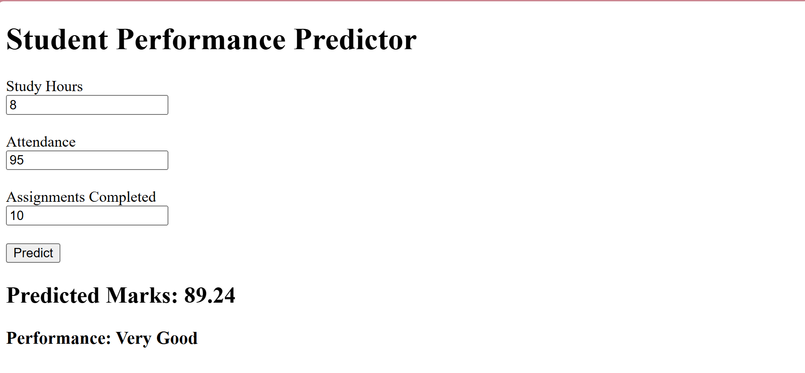

# Student Performance Predictor

A Machine Learning project that predicts student academic performance based on key factors such as study hours, attendance percentage, and assignments completed.

## Application Preview

The project uses a Linear Regression model to analyze student data and estimate expected marks. It demonstrates the complete machine learning workflow, including data preprocessing, model training, evaluation, prediction, and visualization.

## Key Features

- Predict student marks using machine learning
- Analyze the impact of study habits on performance
- Visualize actual vs predicted results
- Evaluate model performance using error metrics
- Beginner-friendly implementation using Python
